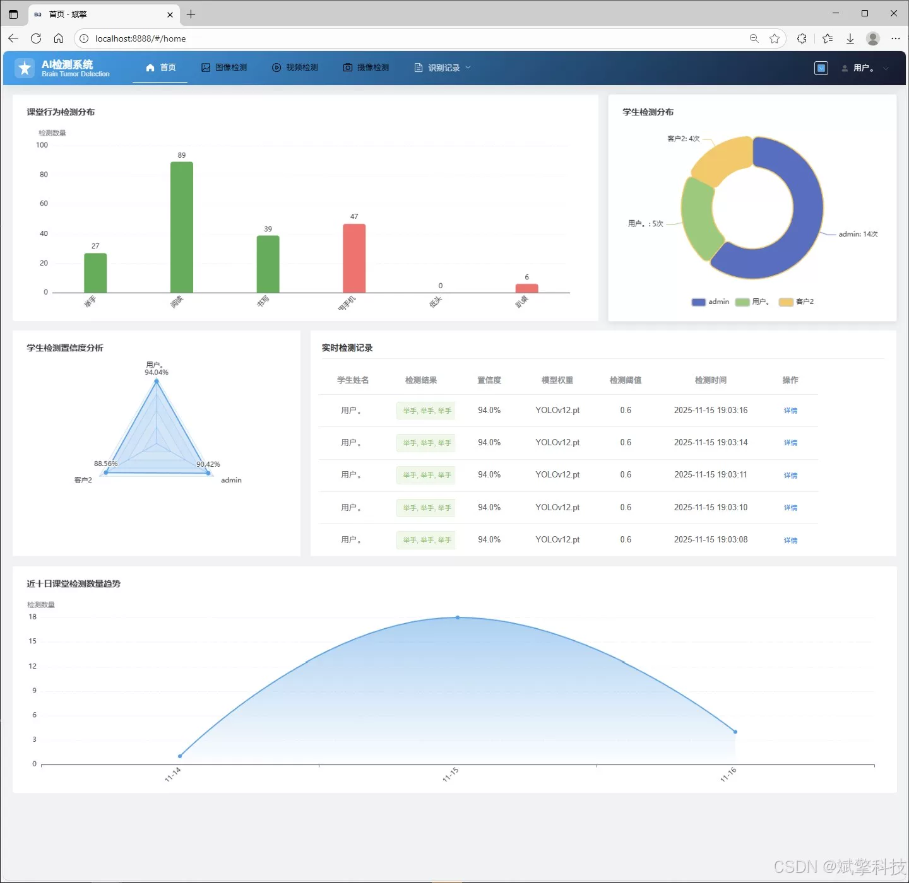
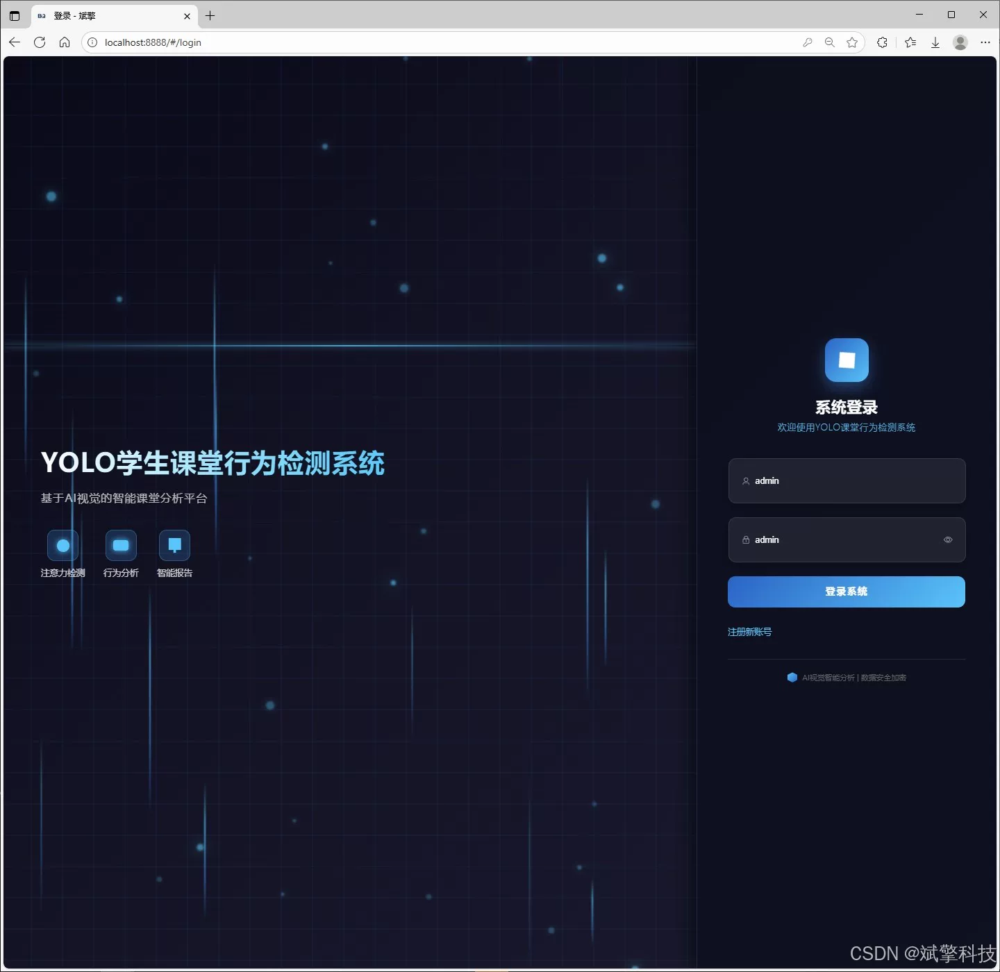
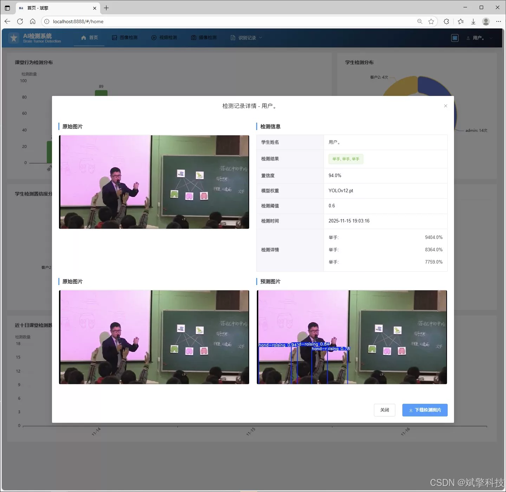
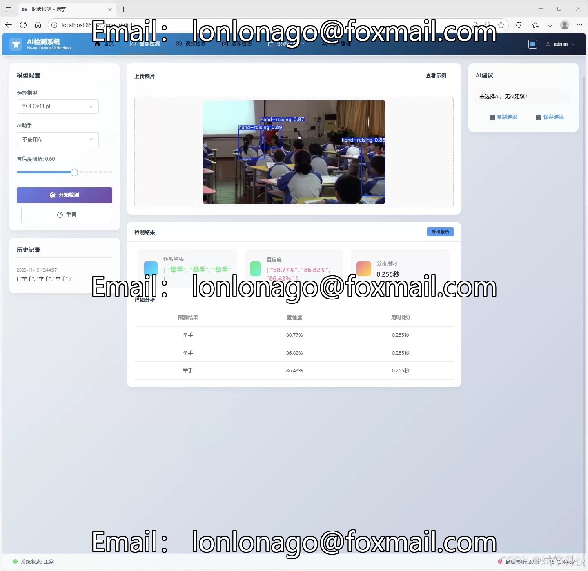
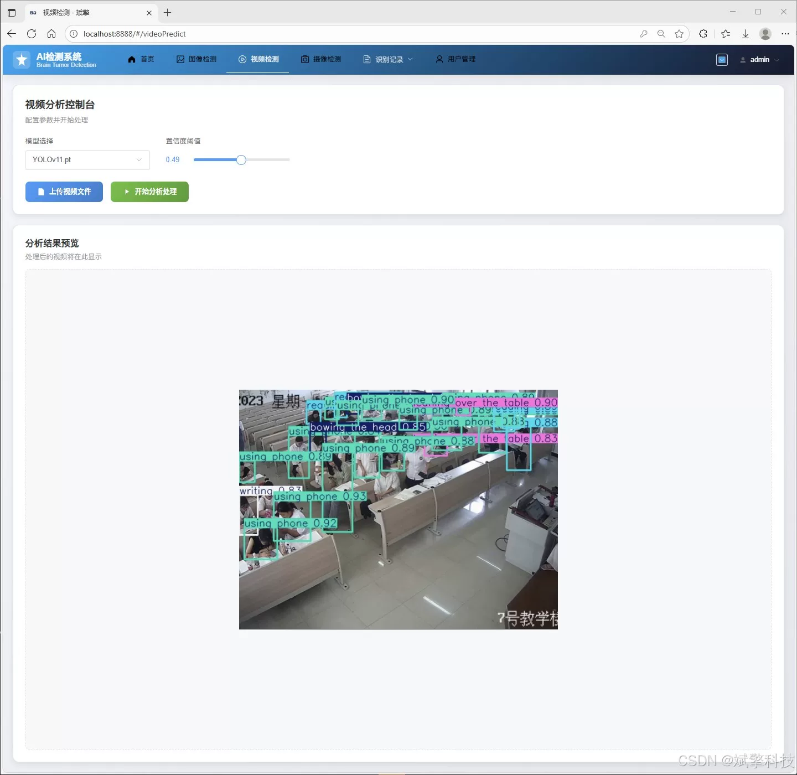
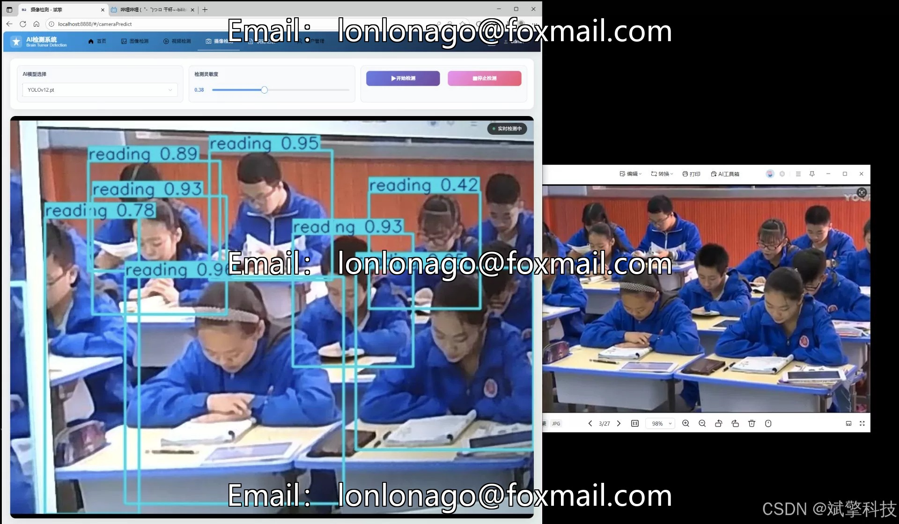
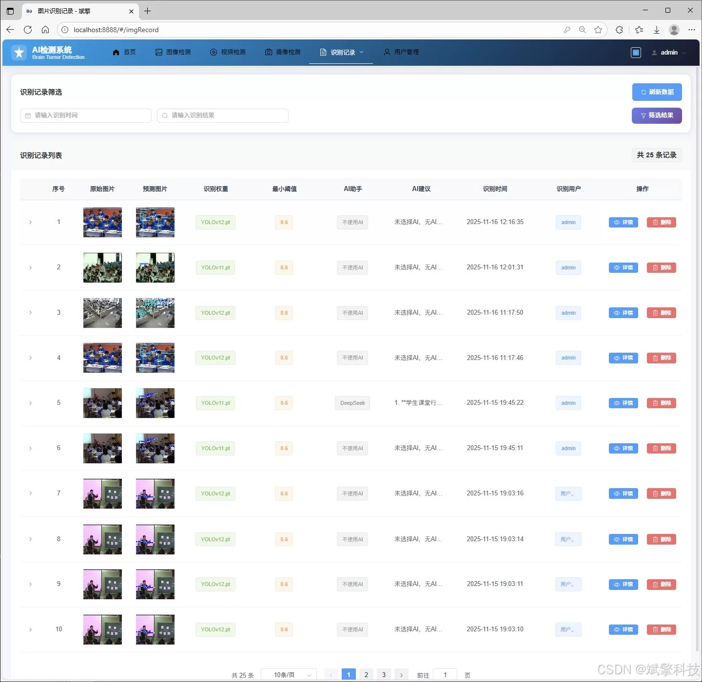
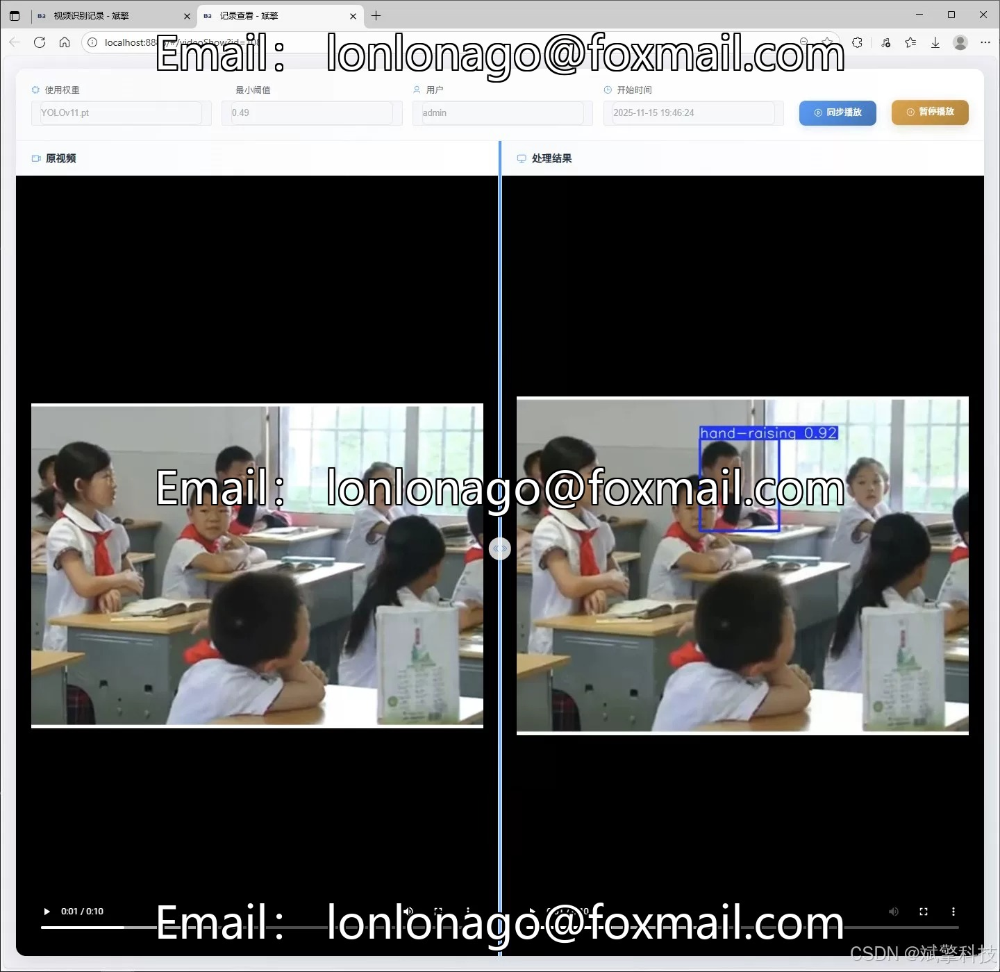
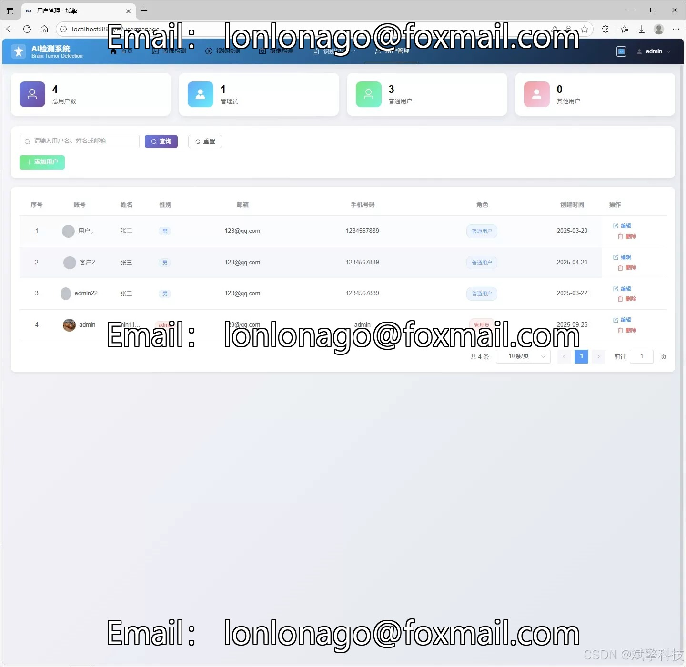

# YOLO+DeepSeek Classroom Behavior Identification

## Body

YOLO+DeepSeek classroom behavior recognition based on YOLO deep learning and Qianwen, DeepSeek big model student classroom behavior recognition detection system (DeepSeek intelligent analysis + web interaction interface + front-end separation + YOLO data + YOLOv8/YOLOv10/YOLOv11/YOLOv12)

The project aims to develop a front-end and back-end separation student classroom behavior intelligent recognition and analysis system based on the advanced YOLO series object detection algorithm (YOLOv8/v10/v11/v12) and SpringBoot framework. The system uses deep learning technology to automatically recognize various typical behaviors of students in the classroom, such as raising hands, reading, writing, using mobile phones, looking down, sitting on the desk, etc. The system provides a Web interaction interface, supports user management, multiple detection modes (images, videos, real-time camera), model dynamic switching, data visualization, and integrates DeepSeek intelligent analysis functions. All recognition records and user data are persistently stored in MySQL database, providing an efficient and intelligent solution for classroom teaching quality assessment and student focus analysis.

Functional module

✅ Information Visualization, Data Visualization.

✅ Image detection supports AI analysis functions, deepseek and Qianwen.

✅ Supports image detection, video detection, and real-time camera detection. The results are saved to a MySQL database.

✅ Picture recognition record management, video recognition record management and camera recognition record management.

✅ User Management Module, administrators can add, delete, modify, and query users.

✅ Personal center, can modify their own information, password name profile picture and so on.

There is no Lunwen writing service, nor any Lunwen.

## Images

## Payment

Here is a pay link on Stripe ( https://buy.stripe.com/3cs8yP7sY87d0vu9AB ). Please contact me lonlonago@foxmail.com after funding $89, and I will send you a complete data files , thank you!

